# Welcome to Projekt Tropfenkette! ✨

A project featuring a box filled with 240 meters of ready-to-use LED strips to make events more colorful. These boxes are stored in hackspaces or at the homes of beings. Coordination of which boxes are used at which events is done through a [Matrix group](https://matrix.to/#/#projekt-tropfenkette:matrix.warpzone.ms).

<table><tr>
<td> 
    <em>My talk about this project at <a href="https://kamphack.de/" target=new>KampHack 2024</a> in <a href="https://www.warpzone.ms/" target=new>warpzone</a> hackerspace in Münster (in german)</em></td>
</tr></table>

 

<table><tr>
<td> <a href="images/at_home.jpg">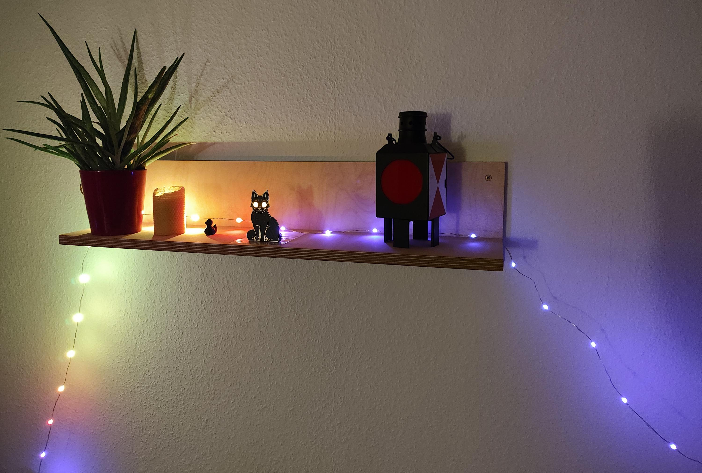</a> </td>
<td> <a href="images/37c3.jpg">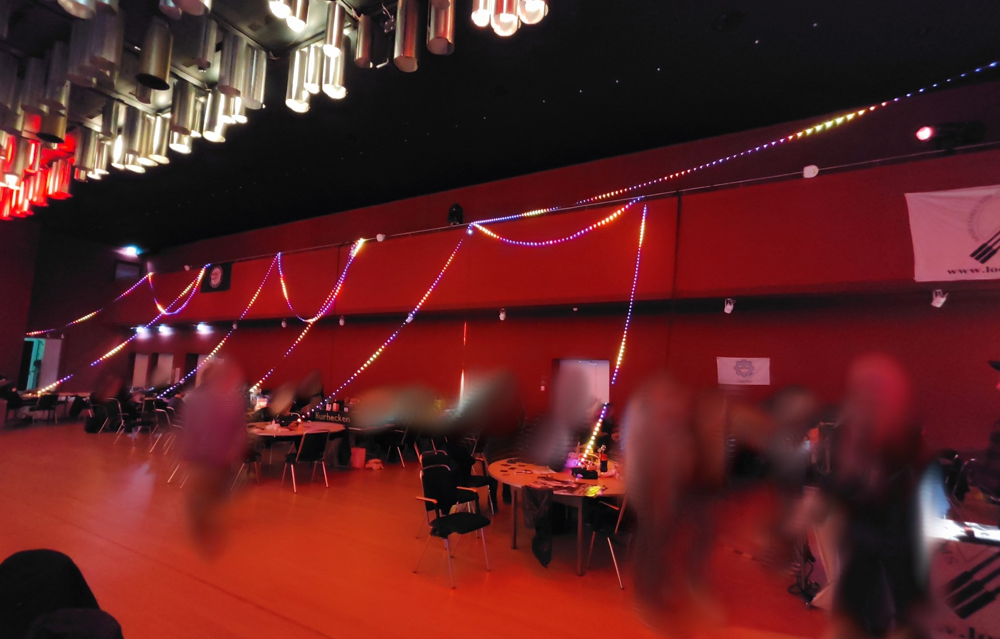</a> </td>

<td> <a href="images/last_summer_1.jpg">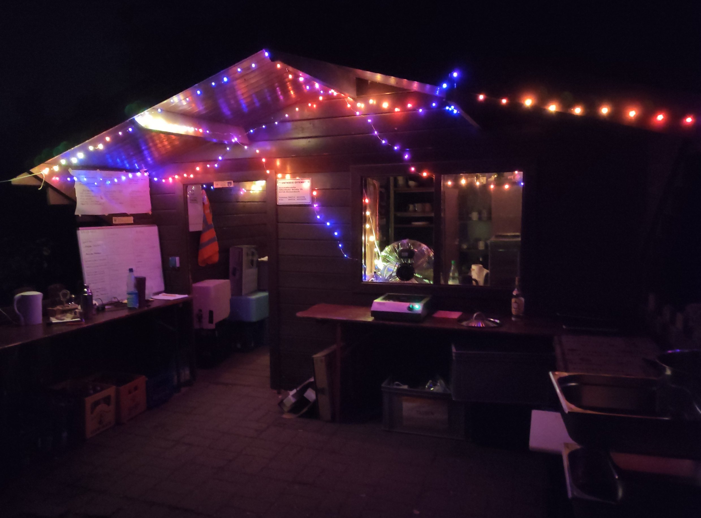</a> </td>
</tr>
<tr><td> <a href="images/last_summer_2.jpg">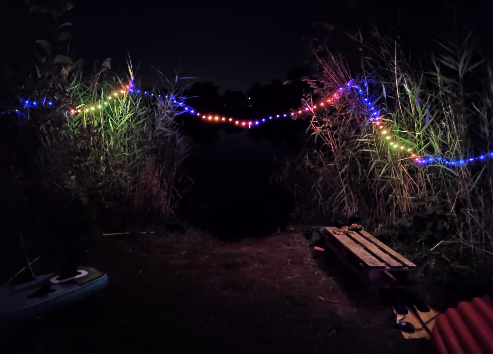</a> </td>
<td> <a href="images/ccc2023.jpg">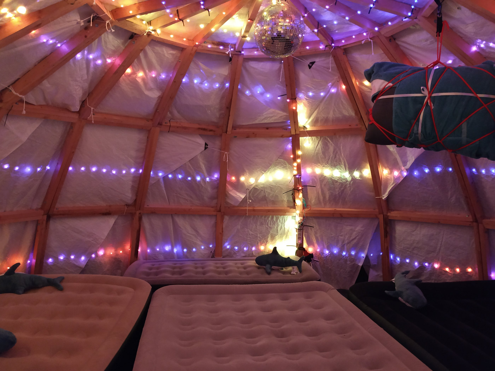</a> </td>
<td> <a href="images/entropia.jpg">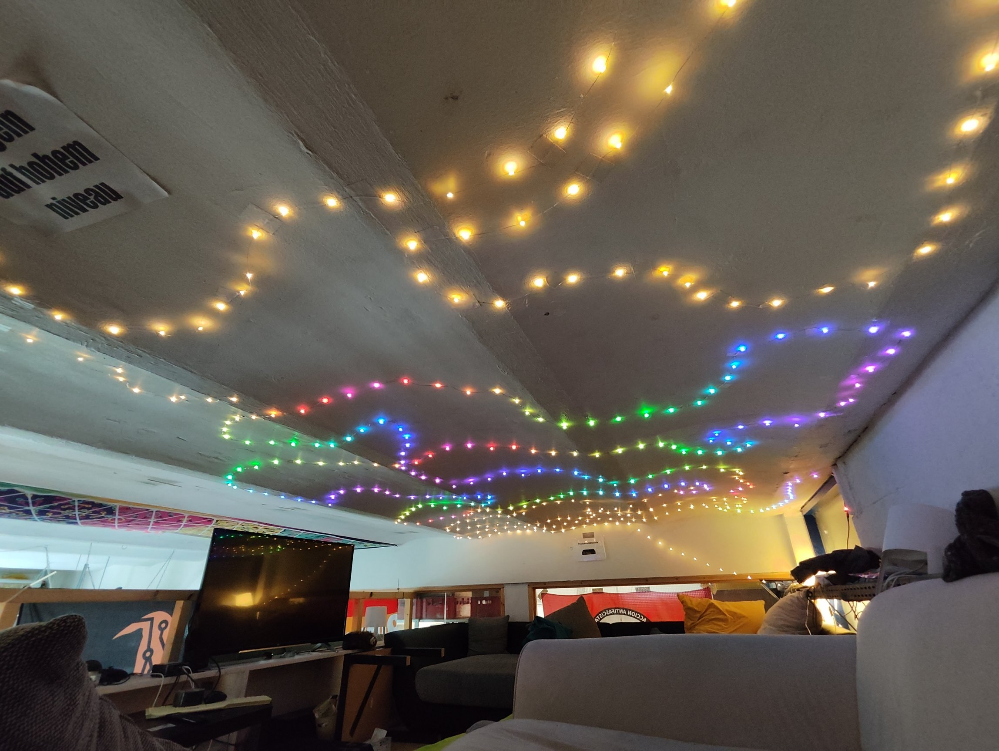</a> </td>
</tr></table>

## Features

- Euro-box dimensions: 30 x 40 x 23 cm (or slightly smaller)
- 20m spools of LED Tropfenkette with 200 addressable RGB LEDs each + USB power supplies
- 3D-printed spools compatible with a power drill adapter
- WLED firmware on an ESP32 microcontroller
- User-friendly web interface
- WiFi and optional Ethernet with PoE support
- All information, instructions, and a service manual available in this Git repository
- A label on the box providing links to this Git repository and the [Matrix group](https://matrix.to/#/#projekt-tropfenkette:matrix.warpzone.ms)
- Each piece is labeled with a "Project Tropfenkette" sticker
- A [Matrix group](https://matrix.to/#/#projekt-tropfenkette:matrix.warpzone.ms) for coordinating the use of the boxes

## Contents of Each Box

<table><tr>
<td> <a href="images/box.jpg">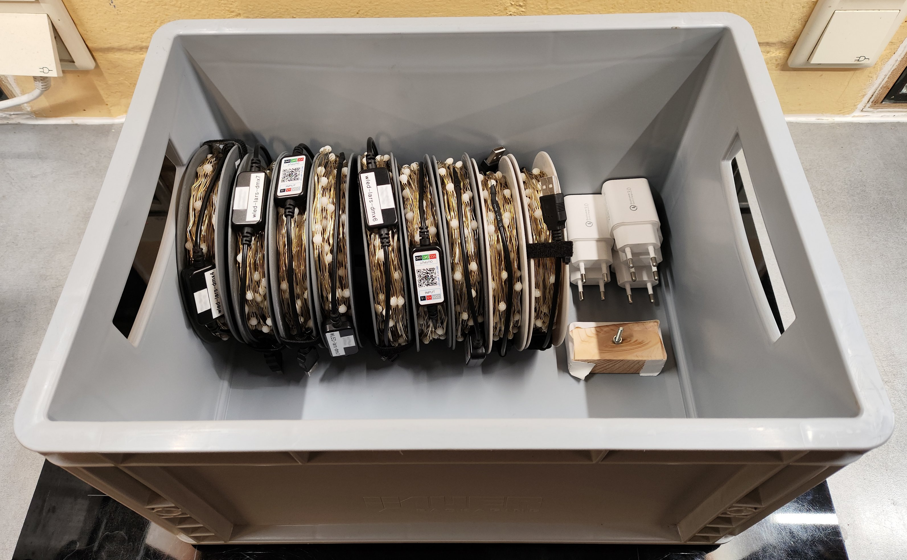</a> </td>
</tr></table>

- 12 LED spools
- 12 WLED controllers
- 18 USB power supplies (to power some strips from both ends)
- 2 power drill adapters
- A bag of reusable cable ties
- 6 hook magnets (maybe)
- 2 spare controllers
- 2 empty spare spools
- Project Tropfenkette stickers
- A rubber duck

## LED Strip

20m long LED strips, available [here](https://www.aliexpress.com/item/1005003243510750.html), consisting of an addressable LED every 10cm on 3x magnet wire (enameled copper wire). Reasons why I really love these LEDs:

- Very high, not visible PWM frequency (non-flickering). Even when moving very fast in front of your eyes, it appears as a single line.
- Very good and intense colors, including a nice RGB-mixed white.
- Good omnidirectional light distribution.
- Very low idle current of 0.0125mA/LED, compared to other LEDs that need ~1mA.
- High ESD stability.

A disadvantage is the low mechanical durability due to being made of single stranded, thin insulated wires. However, with careful handling, they last many events and are quite easy to repair.

For most WLED effects, powering them from one side is sufficient. Plugs on both ends allow optional dual-side power. However, their brightness when powered from one side is moderate. For illumination purposes, you might need many strips or alternative solutions. Their true strength lies in creating a pleasant ambiance.

The strips are lightweight, enabling easy horizontal suspension over distances of 20m or 40m when connecting two strips end-to-end.

### Water Resistance

The strips are somewhat water-resistant. Exposure to rain or damp grass poses no issue. However, submersion beyond of more than ~3m of ledstrip may lead to erratic behavior due to high capacitance (as tested in a pool).

### Hardcoded Addresses

Unlike on most other strips these LEDs are all connected in parallel, so each LED gets the same signal. That means, every LED has a hardcoded address. The low idle-current is a benefit of this. However, this means strips cannot be serially chained without duplicating control signals. For instance, if you connect two 200 LED strips in series, you still have the address range 1-200 instead of 1-400. If you activate one LED, the corresponding LEDs on both strips will light up. This requires careful planning for specific lighting designs. In this project enery strip gets its own microcontroller pin.

## The Spool

The spool for winding the strip is 3D printed ([STL 1](stl/spool-1.stl), [STL 2](stl/spool-2.stl)) in two halves and then glued together. Currently, a simple wooden piece with an M5 screw serves as a makeshift power drill adapter. A 3D printed version have to be designed.

<table><tr>
<td> <a href="images/spule_druck_1.png">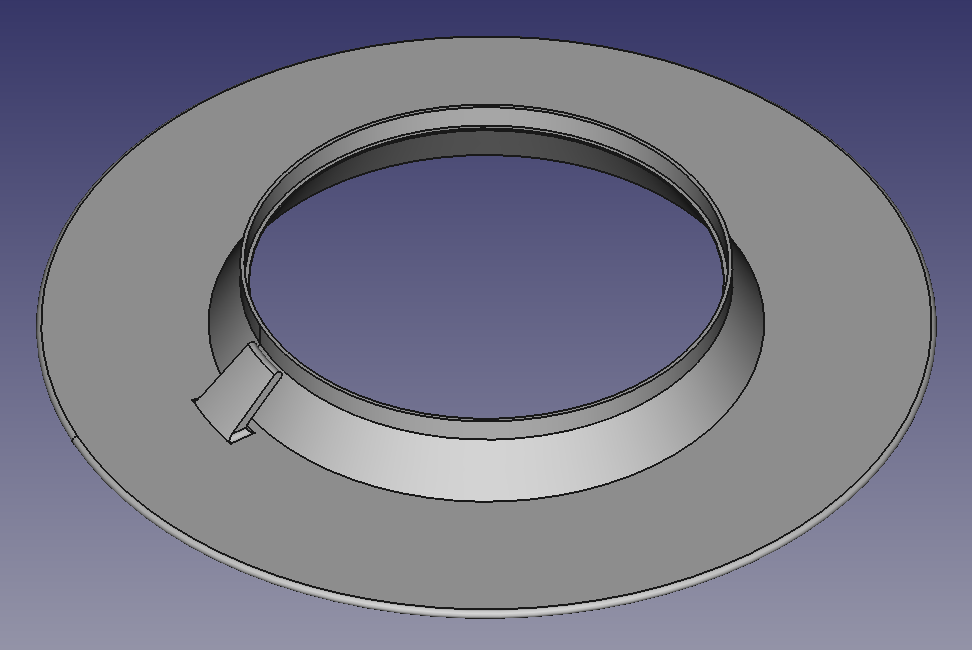</a> </td>
<td> <a href="images/spule_druck_2.png">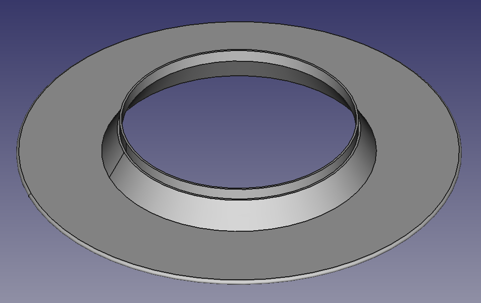</a> </td>
</tr></table>
<table><tr>
<td> <a href="images/spool.jp">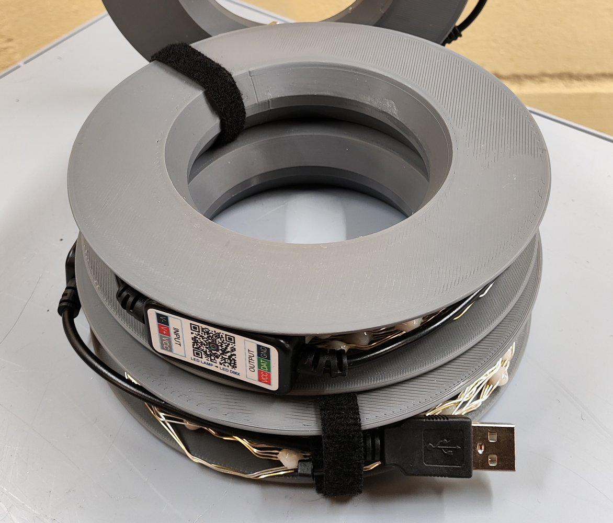</a> </td>
<td> <a href="images/drill.jpg">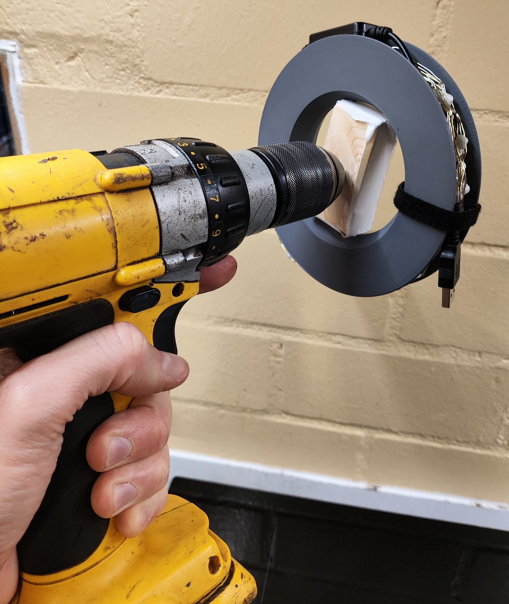</a> </td>
</tr></table>

## USB Power Supply

A simple 5V 3A [USB power supply](https://www.amazon.de/Ladeger%C3%A4t-Schnellladeger%C3%A4t-Ladestecker-Netzteil-Schnellladung-4er-Pack-Schwarz/dp/B0C3B7FL8Z). We tested (secutest) a few of them; they were safe. The power is sufficient, even if there is no current limit set in WLED. The wire resistance limits the current to ~2.3A.

## The Simple Controller with Standard Components

<table><tr>
<td> <a href="images/simple_controller_1.jpg">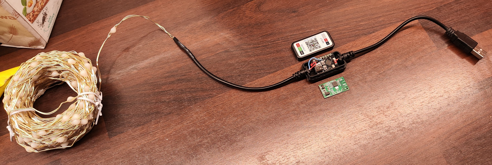</a> </td>
<td> <a href="images/simple_controller_2.jpg">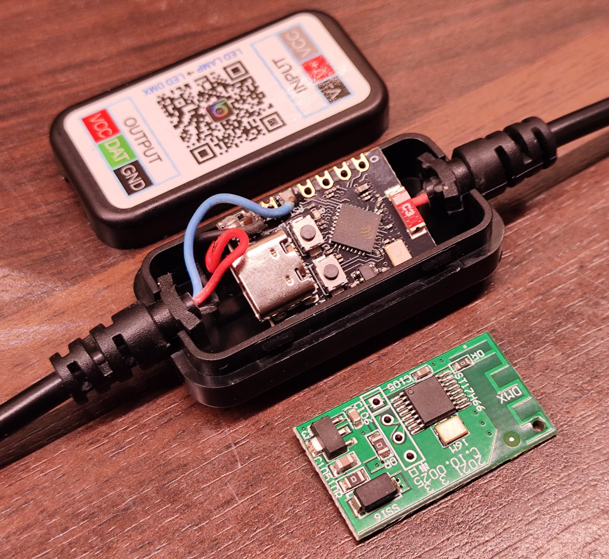</a> </td>
</tr></table>

Ready to use [ESP32-C3-board](https://www.aliexpress.com/item/1005005967641936.html) with USB-C from AliExpress. Every 20m LED strip gets its own controller for convenience and because of the maximum current. The LED strips are shipped with a proprietary bluetooth controller, which gets replaced by our WLED controllers.

<table><tr>
<td> <a href="images/simple_controller_solder_1.jpg">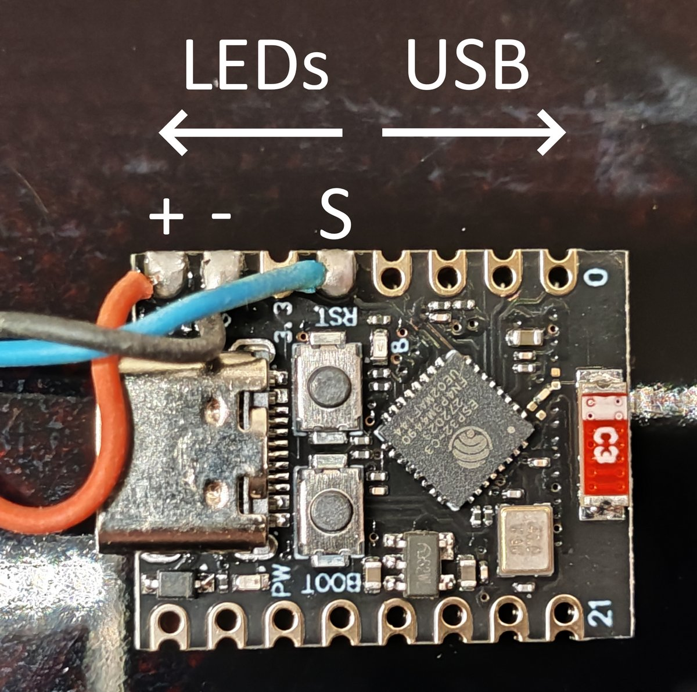</a> </td>
<td> <a href="images/simple_controller_solder_2.jpg">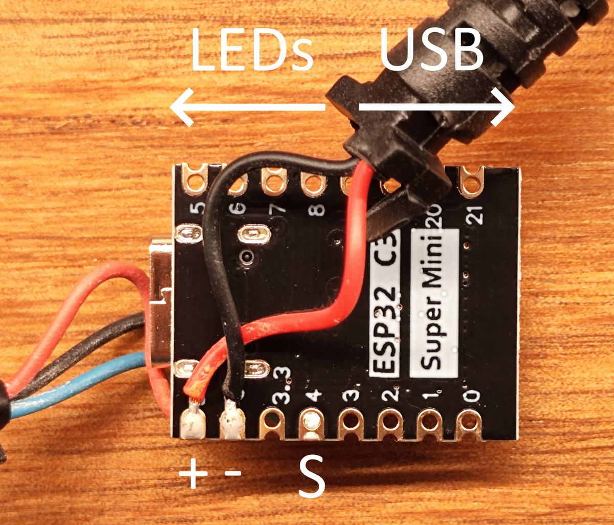</a> </td>
</tr></table>

How to solder:

- Open the case and unsolder the bluetooth controller.
- Touch the wire ends of the LEDs with your soldering iron to make them pointy.
- Clamp the board somewhere, but be careful not to destroy the very small smd parts.
- Put the 3 wires coming from the LEDs through the holes in the board and solder them with a bit of solder wire.
- Then solder the 2 USB-wires to the back of the board. Make sure to heat them up enough to get a good connection and short enough to not unsolder the LED-wires. The soldering points should be quite flat to fit into the case.

## Software

The strips are controlled by [WLED](https://kno.wled.ge/), firmware with many input options and a web interface to easily create nice effects. There are two common websites to flash WLED:

- The official one: <https://install.wled.me/> (Usually we use the newest build from here)
- And the fancy one: <https://wled-install.github.io/> (If you want more fancy features, use the nightly build)

Flash:

- Open the case and connect the ESP-Board via USB-C port, the USB-A plug is not for flashing!
- Open flash-page in a web-uart capable browser like chrome, choose the com port and the newest build of WLED.

Configuration:

- After flashing, connect to the `WLED-AP` Wifi. The landing page should open automatically. If not, enter <http://4.3.2.1> in browser.
- TO THE CONTROLS! > Config > Security & Updates >
  - Restore presets: [choose file](cfg/wled_presets.json) > Upload
  - Restore configuration: [choose file](cfg/wled_cfg.json) > Upload
- The ESP will restart now. Now connect to Wifi again:
- WIFI SETTINGS > AP SSID: `WLED-[your name]-tk[number]`. For example `WLED-larsm-tk1`. Also write this name onto the controller-case.
- If you want to put the strips into an existing Wifi you can do so in Wifi Settings.
- The current limit in `LED Preferences` is not set because the wire resistance is limiting the current enough. Also different limits were needed whether powering from one or both ends. It may result in strange looking effects by missing colors at the not powered end of the strip. Lower the brightness of the effect until it is ok.

### Default effect

WLED comes with many different effects and color schemes. The default effect is `Plasma` and the default color scheme is `Yelblu Hot` on full brightness. This is saved on Preset no 1 and loaded on boot. It is a slow, cosy effect using mostly yellow and orange but also a bit blue and purple. It sums up to a candle-like very warm white.

### Wifi name and PW

The SSID is printed on each controller-case `WLED-larsm-tk1`. The default PW is `wled1234`. This is a widely known PW. Please do only change it for a good reason and change it back after usage.

## Usage Guide

### Coordination

Utilize the [Matrix group](https://matrix.to/#/#projekt-tropfenkette:matrix.warpzone.ms) for coordination with hosts of other boxes. Ask them to bring boxes or offer your box.

For events involving larger installations, it's crucial to consult with the event organizers regarding **fire safety regulations (Brandschutz)** and **emergency exit routes (Fluchtwege)**.

### Use Cases

Choose your level of complexity:

1. **Simple Setup**: Unroll a few strips and power them via USB to enjoy the nice default effect.

2. **Intermediate**: Optionally, connect to the Wi-Fi printed on each controller (default password: `wled1234`). Access the web interface at <http://4.3.2.1> to customize effects.

3. **Advanced Synchronization**: WLED features an easy-to-use function for syncing effects across multiple controllers. Ensure they're connected to the same network via Wi-Fi or Ethernet.

4. **Professional-Level Control**: For granular control over every pixel across numerous strips in real-time, consider using Streaming ACN (sACN) over Ethernet.

## Help!!11!

**LED-strip broken:** please solder and insulate broken wires, ask for help in your lokal hackspace and drink a mate.

**Controller broken:** Things you can try: connect to wifi, connect no or another ledstrip, reflash the controller. Use a multimeter and check voltages and currents.

**Something needs to be replaced or got lost:** It would be nice to keep this project alive by the awesome hacking community. So donations of replacement parts would be very welcome. If you, your fellow hackers or your hackspace cannot afford it, please contact the [Matrix group](https://matrix.to/#/#projekt-tropfenkette:matrix.warpzone.ms).

## Two types of LEDs are sold :-(

These strips are sold with 2 kinds of LEDs on aliexpress which look the same on photos but with huge quality differences. Here a comparison:

|                                    | Good strip                                                                 | Bad strip                                                                |
|------------------------------------|----------------------------------------------------------------------------|--------------------------------------------------------------------------|
| Protocol                           | default 3 wire WS28*                                                       | default 3 wire WS28*                                                     |
| LED type                           | custom nameless LED without extra plastic case within the glue drop        | default WS2812B LED, you can see the quadratic case within the glue drop |
| PWM-frequency                      | very high == invisible                                                     | ~1-2Khz == flickering                                                    |
| Omnidirectional light distribution | noticeable but quite good                                                  | very noticeable                                                          |
| Quality of colors                  | nice                                                                       | a bit less intense                                                       |
| Quality of RGB-mixed white         | clean and nice white                                                       | unpleasant red tinge                                                     |
| Interconnection on the wires       | parallel, each LED gehts the same signal, each LED has a hardcoded address | serial, default WS2812B LED with signal amplifier in each LED            |
| Color of the wire (insolation)     | a bit more copper-like                                                     | a bit more silver-like (not a huge difference, hard to tell on photos)   |
| Idle-current [mA/LED]              | 0,0125                                                                     | 0,50                                                                     |
| Current, white 50% [mA/LED]        | 18,25                                                                      | 24,77                                                                    |
| Current, white 100% [mA/LED]       | 35,45                                                                      | 42,93                                                                    |
| Digital color-order                | RGB                                                                        | GRB                                                                      |
| Brightness                         | is hard to tell without measuring it                                       |                                                                          |
| Price                              | quite equal                                                                |                                                                          |

So how to buy the good ones? There are a couple of dealers on aliexpress selling them. A good approach is to maintain a list of dealers and their offers, along with records of successful and unsuccessful purchases:

| good or bed | known good order | known bad order | Dealer                  | link                                                          | comment                                                         |
|-------------|------------------|-----------------|-------------------------|---------------------------------------------------------------|-----------------------------------------------------------------|
| ✅           | 2024-03-15       | -               | Mi Light Store          | [link](https://www.aliexpress.com/item/1005003243510750.html) | as seen on 37c3 and eh21 :-)                                    |
| ✅           | ~2023-11-20      | -               | Aurboos LED Strip Store | [link](https://de.aliexpress.com/item/1005004753971048.html)  | Type: "Copper Wire"                                             |
| ❌           | -                | 2023-10-13      | LOAMLIN Official Store  | [link](https://www.aliexpress.com/item/1005001917228863.html) | Seller wrote 2023-11-14: the good ones are no longer available. |

Another thing: when ordering a 20m strip, you always get 2 10m pieces that are soldered together in the middle. In one delivery of the otherwise good strips, they were incorrectly addressed, namely 1-100 + 1-100 instead of 1-200. However, this only happened with one of many orders. Please test this upon arrival.

If something is not right, it is now very straightforward to return it on AliExpress. Simply click in the order overview, receive a shipping label, send it to a German address, and receive the refund within about 1 week.

## Bill of Materials - BOM

[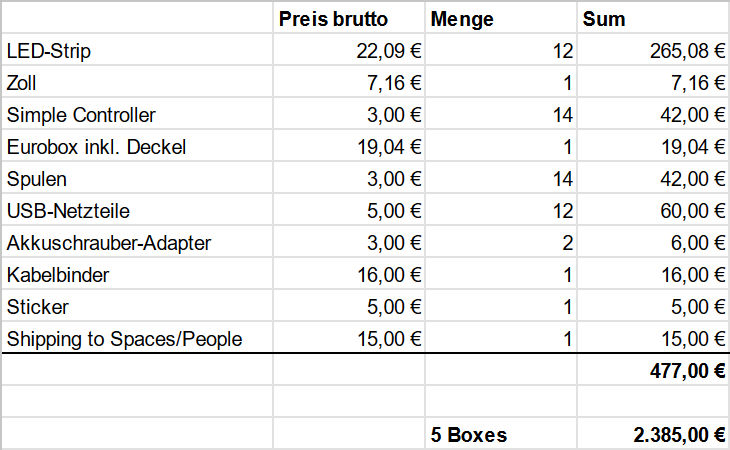](https://docs.google.com/spreadsheets/d/1PHROypnwYwpfAeiwreOVh2BaQhaZet9fSIjJTCfw_kE)

## The funding

The project, consisting of 5 boxes, is hoped to be financed by the CCC. For more details, refer to the [Projektantrag](Projektantrag.md).

## Vision

I would really love to see a lot of these LEDs many feature events! It would be great to see nearly all of them illuminating next congress! :D

### The Advanced Controller with Custom Board

Vision: Custom WLED PCB with ESP32, microphone, and PoE. It can be used standalone or controlled via WiFi and powered by USB-C, or controlled and powered by Ethernet. If powered with more than USB 5V, more than 1 strip can be connected to 1 controller. Use the button on the PCB to switch through effects. I have already found some nice people who are definitely able to design this PCB, and they are hopefully willing to do it. :-)

### Microphone-Box

Vision: A small 3d-printed box with an [ESP32 board and a microphone](https://github.com/NandXor96/USBWLEDC) inside without LEDs. It can be used to control the audioreactive effects of the Tropfenketten. The network latency is quite high in WLED 0.15. We should wait for improvements.

### Other types of LEDs

Vision: Maybe the project will grow and other types of LEDfoo will spawn. For example the 2m long pipes wrapped with LED-Strip as seen on 37C3.
